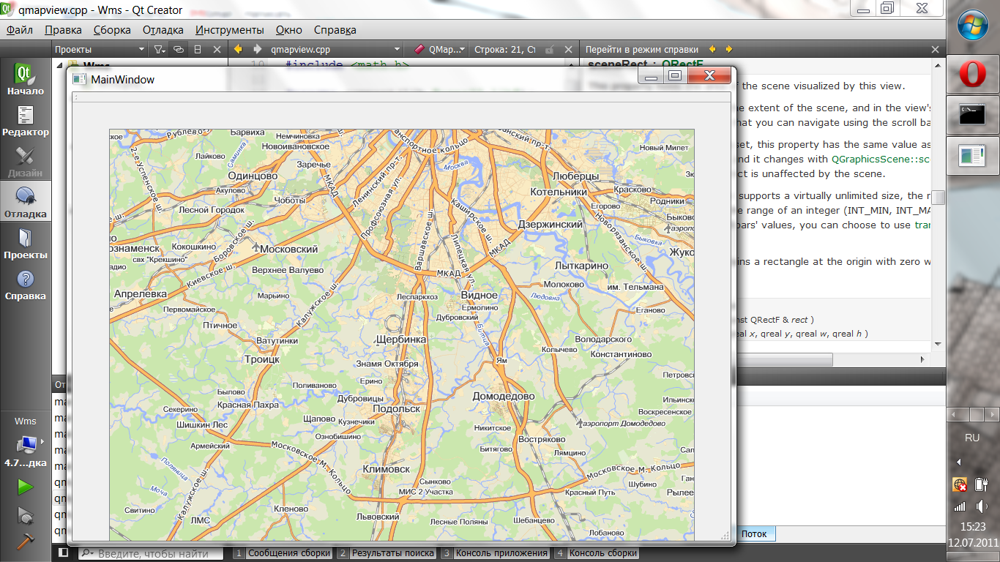

# YandexMapsClient

2011 legacy project.
Qt4 map viewing widget: downloads and shows map tiles from legacy yandex.maps server interface (reverse engineered) and WMS interface.

Features:

*Downloads map tiles;
*Shows map tiles as a map;
*Supports scale levels;
*Support mouse control: drag for move, wheel for scale;
*Solving direct geodetic problem;
*Solving reverse geodetic problem 

